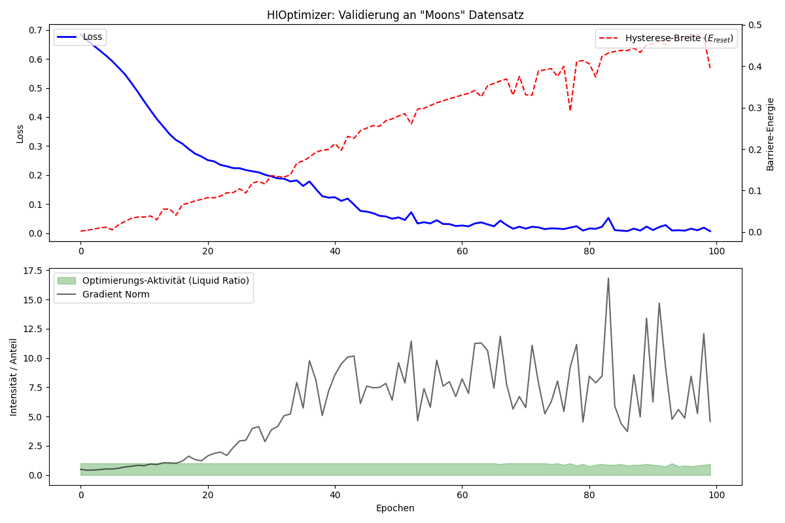

# HysteroGrad
### Hysteretic Information-Geometric Optimizer

HysteroGrad is a PyTorch-based optimizer that treats the neural network parameter space as a physical system with memory. It combines **Natural Gradient Descent** with a **Dynamic Schmitt-Trigger** mechanism to enforce self-stabilization and noise immunity.

> "HysteroGrad was designed to extract the 'essence' of a dataset. It is immune to short-term statistical fluctuations, as the dynamic hysteresis acts as a low-pass filter for parameter updates."

---

## Origin & Inspiration
This project is a spin-off from theoretical research into **Quantum Mechanics** and **Information Geometry**. The core idea rests on the analogy between the accumulation of information in neural networks and path functionals in physical spaces.

Just as a material "stiffens" under stress (work hardening), HysteroGrad stiffens the parameter space as the model accumulates information (\(\tau\)), eventually "freezing" the weights to protect the learned structure.

---

## Key Concepts

1.  **Metric Tensor (Fisher Information):** Uses Riemannian geometry to adapt the step size to the local curvature of the loss landscape.
2.  **Internal Time (\(\tau\)):** A path functional that accumulates the "metric distance" traveled by the model during training.
3.  **Dynamic Hysteresis:** An energy barrier that grows with \(\tau\).
4.  **Liquid vs. Frozen States:** The optimizer automatically switches between a high-plasticity "Liquid" state and a stable "Frozen" state based on the signal-to-noise ratio of the gradient.

---

## Mathematical Core

The update rule is governed by:

$$ \Delta \theta = \begin{cases} -\eta G^{-1} \nabla \mathcal{L} & \text{if } \|G^{-1} \nabla \mathcal{L}\| > f(\tau) \\ 0 & \text{otherwise (Frozen State)} \end{cases} $$

Where $G$ is the Fisher Information Matrix and $f(\tau)$ is the stiffening functional.

*For a deep dive into the theory, see [docs/math_theory.md](docs/math_theory.md).*

---

## Installation

```bash
git clone https://github.com/dingste/HysteroGrad.git
cd HysteroGrad
pip install -r requirements.txt
```

---

## Quick Start

```python
import torch
from hysterograd import HIOptimizer

# 1. Initialize Model
model = MyModel()

# 2. Initialize Optimizer
# stiffening_factor controls how fast the "freezing" happens
optimizer = HIOptimizer(model.parameters(), lr=1e-3, stiffening_factor=0.05)

# 3. Training Loop
for data, target in dataloader:
    optimizer.zero_grad()
    output = model(data)
    loss = criterion(output, target)
    loss.backward()
    
    # The step function returns the current system status
    status, grad_norm, h_width = optimizer.step()
    
    if i % 10 == 0:
        print(f"Loss: {loss.item():.4f} | Status: {status} | Barrier: {h_width:.4f}")
```

---

## 📊 Validation & Results

On standard benchmarks (e.g., "Moons" dataset and CIFAR-10), HysteroGrad demonstrates rapid initial convergence followed by automatic stabilization.

### 1. Moons Dataset (Non-linear Classification)


*   **Top Plot:** Shows the Loss (blue) decreasing rapidly. The Hysteresis Barrier (red dashed line) grows over time as the system accumulates "internal time" ($\tau$).
*   **Bottom Plot:** Displays the system's activity. The green areas indicate the **Liquid** state where updates occur. As the gradient norm (black) falls below the rising barrier, the system enters the **Frozen** state.

### 2. CIFAR-10 (Image Classification)

#### Compute-Efficiency Metric: Accuracy per PFLOP (APF)

##### Motivation

When training deep neural networks on consumer-grade CPU hardware, wall-clock time and FLOPs
quickly become the dominant constraints. Traditional reporting in terms of epochs or final accuracy
alone does not capture how efficiently a model converts compute into generalization performance.

To address this, we introduce **Accuracy per PFLOP (APF)** as an auxiliary efficiency metric.

---

##### Definition

**Accuracy per PFLOP (APF)** is defined as:

$$
\text{APF} = \frac{\text{Test Accuracy (\%)}}{\text{Total Compute (PFLOPs)}}
$$

This metric quantifies how much test accuracy is achieved per unit of cumulative compute.

---

##### Interpretation

- High APF values indicate **early learning efficiency**, i.e. rapid gains in accuracy for low compute cost.
- APF naturally decreases over training time as marginal accuracy improvements become more expensive.
- APF is **not intended to replace final accuracy**, but to complement it in compute-constrained settings.

This metric is particularly relevant for:
- CPU-bound training
- consumer hardware
- exploratory or low-budget experimentation
- optimizer and training-dynamics research

---

##### Experimental Context

- Hardware: Consumer-grade CPU
- Precision: FP32
- No mixed precision or GPU-specific optimizations
- FLOPs are accumulated per forward + backward pass

As a result, absolute APF values are **hardware- and setup-dependent** and should be compared
*only within similar constraints*.

---

##### Example Results 

#### - (Enhanced SimpleCNN - VGG Style, CPU)

*   **Model:** 3-Block CNN (64-256 channels) + BatchNorm.
*   **Peak Accuracy:** **82.78%** (within 10 Epochs).
*   **Computational Cost:** **~0.49 PFLOPs** total for 10 epochs.
* 	**APF:** 168.94 %/PFLOP.
*   **Dynamics:** 
    *   **Status:** Remained "Liquid" throughout the run (no premature freezing).
    *   **Gradient Clipping (2.0):** Stabilized the updates in the high-curvature feature space.
    *   **Metric Scaling (1000x):** Successfully amplified the natural gradient signal to overcome the noise in early training.


#### - (WRN28-2, CPU)

| Epoch | Test Accuracy (%) | Total PFLOPs | APF (% / PFLOP) |
|------:|------------------:|-------------:|----------------:|
| 1     | 52.27             | 0.0777       | 673.5           |
| 2     | 62.16             | 0.1553       | 400.2           |
| 3     | 64.78             | 0.2329       | 278.2           |
| 5     | 68.10             | 0.3883       | 175.4           |
| 10    | 69.40             | 0.7765       | 89.4            |

These results illustrate that a large fraction of generalization performance is obtained
within a relatively small compute budget.

---

#### Limitations

- APF depends on dataset, architecture, hardware, and precision.
- FLOPs do not capture memory bandwidth or cache effects.
- Estimated reference values should not be used for formal benchmarking.

---

## Advanced Mechanics 

Based on thermodynamic principles, the optimizer now includes:

1.  **Geometric Cooling (Annealing):**
    Delays the "freezing" phase by starting with a high "temperature" ($T$). This suppresses the hysteresis barrier initially, allowing for broad exploration before settling into fine-tuning.
    
2.  **Layer-Specific Hysteresis:**
    Different layers freeze at different rates.
    *   **Features (Conv Layers):** High stiffening -> Freeze fast (learn stable edges/shapes).
    *   **Classifier (FC Layers):** Low stiffening -> Freeze slow (adapt logic to fixed features).

3.  **Activity Feedback (Geometric Shock):**
    If validation accuracy stagnates while loss remains high, the system induces a "shock" (reducing internal time $\tau$). This lowers the energy barrier, momentarily liquefying the weights to escape local minima.

4.  **Metric Scaling:**
    Massively amplifies the Fisher Information matrix (Metric Tensor) for high-dimensional data (like images). This ensures the natural gradient updates are appropriately scaled to the curvature of the loss landscape.

5.  **Adaptive Thresholds:**
    The hysteresis width now scales dynamically with the "Energy" of the parameter space (Gradient Norm). This prevents premature freezing in high-energy regions and ensures the barrier is relative to the local turbulence.

6.  **Gradient Clipping & Hysteresis Scaling:**
    *   **Clipping:** Artificially limits the "Kinetic Energy" (Gradient Norm) of the updates to a fixed ceiling (e.g., 20.0).
    *   **Scaling:** Multiplies the "Potential Energy" (Hysteresis Barrier) by a factor (e.g., 5.0).
    *   **Goal:** Force the system into a regime where the energy and the barrier intersect, mandating phase transitions.


---

## Comparison with Standard Optimizers

HysteroGrad occupies a unique niche between traditional gradient descent and second-order methods.
For contextual orientation, approximate efficiency ranges for common optimizers are shown below.
These values are **estimates**, not direct measurements, and were **not obtained under identical
hyperparameters or training schedules**.

| Feature | **SGD (Stochastic Gradient Descent)** | **Adam / RMSprop** | **HysteroGrad** |
| :--- | :--- | :--- | :--- |
| **Update Basis** | Euclidean Gradient | Scaled Gradient (Running Average) | **Natural Gradient (Fisher Metric)** |
| **Geometry** | Flat (Euclidean) | Diagonal Approximation | **Riemannian (Curved)** |
| **Convergence** | Slow, prone to oscillation | Fast, adaptive | **Extremely Fast (Initially)** |
| **Stability** | Low (needs tuning) | Medium (can diverge) | **High (Self-Stabilizing)** |
| **Stopping Criteria**| Manual (Epochs / Val Loss) | Manual | **Automatic (Hysteresis Barrier)** |
| **Noise Handling** | Noise flows into updates | Smoothed by averaging | **Filtered by Schmitt-Trigger** |
| **Typical APF Range (% / PFLOP)** | ~60 – 250 |  ~80 – 350   / ~70 – 300  | **~90 - 670** |

These reference values are provided **solely for qualitative comparison** and should not be
interpreted as definitive performance rankings.


---

## Potential Applications

*   **Information Geometry:** Stabilizing Natural Gradient Descent in flat minima.
*   **Neuromorphic Computing:** Algorithmic compatibility with memristive hardware (native hysteresis).
*   **Continual Learning:** Protecting old knowledge by "freezing" important parameters while keeping others "liquid" (similar to Elastic Weight Consolidation).

---

## Community & Feedback
I developed this model out of a deep fascination for physical processes in information theory. 

**I would love to hear how you use it!** Whether for academic research, generative art, or industrial applications—please open an issue or reach out. Your use cases help explore the bridge between Quantum Physics and AI.
